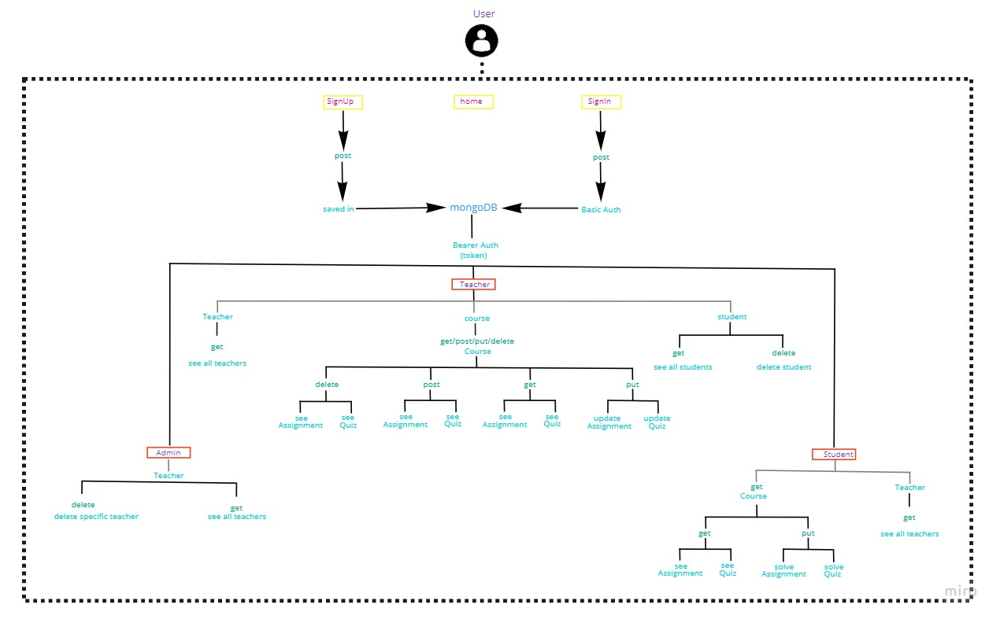
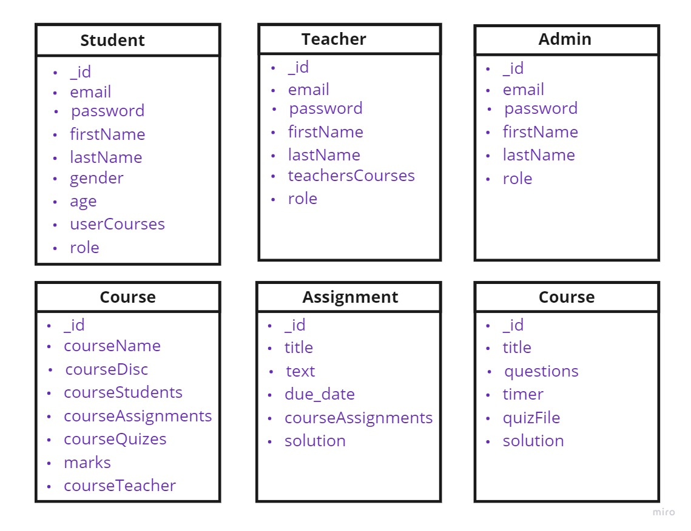
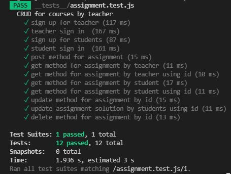
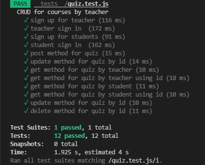
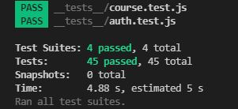

# Prof-Devs-backend

## Authors :

- Dina Khaleel
- Ibrahim AbuAwad
- Sukina AbuHamad
- Haneen AboNser

## Project Name :

Prof Academy
## Project Idea : 

Educational process is taking a critical path and become online according to current circumentences (COVID-19),So it was a good idea to create an online academic website that facilitates the educational process,serves students with multiple courses,provides private rooms for chatting between students and teacher and recognizes a seperated access for each teacher and student.

## Routes :

- Authintication Routes

| Method      | Endpoint     | Description    |
| :----------- | :----------- | :----------- 
| POST      | /signup/student   | sign up for student   |
| POST      | /signup/teacher   | sign up for teacher   |
| POST      | /signup/admin   | sign up for admin   |
| POST      | /signin/user   | sign in for student   |
| POST      | /signin/teacher   | sign in for teacher   |
| POST      | /signin/admin   | sign in for admin   |

- Course Routes

| Method      | Endpoint     | Description    |
| :----------- | :----------- | :----------- 
| GET      | /course/student   | see all courses for course by student   |
| GET      | /course/student/:id   | see specific course for course by student   |
| GET      | /course/teacher  | see all courses for course by student   |
| GET      | /course/teacher/:id   | see specific course for course by teacher   |
| POST      | /course   | create assignment for course by teacher    |
| PUT      | /course/id   | update specific assignment for course by teacher   |
| DELETE      | /course/id   | delete specific assignment for course by teacher   |

- Assignment Routes

| Method      | Endpoint     | Description    |
| :----------- | :----------- | :----------- 
| GET      | /assignment/student   | see all assignments for course by student   |
| GET      | /assignment/student/:id   | see specific assignment for course by student   |
| GET      | /assignment/teacher  | see all assignments for course by student   |
| GET      | /assignment/teacher/:id   | see specific assignment for course by teacher   |
| POST      | /assignment   | create assignment for course by teacher    |
| PUT      | /assignment/id   | update specific assignment for course by teacher   |
| PUT      | /assignment/student/id   | update specific assignment for course by student   |
| DELETE      | /assignment/id   | delete specific assignment for course by teacher   |

- Quiz Routes

| Method      | Endpoint     | Description    |
| :----------- | :----------- | :----------- 
| GET      | /quiz/student   | see all quizes for course by student   |
| GET      | /quiz/student/:id   | see specific quiz for course by student   |
| GET      | /quiz/teacher  | see all quizes for course by student   |
| GET      | /quiz/teacher/:id   | see specific quiz for course by teacher   |
| POST      | /quiz   | create assignment for quiz by teacher    |
| PUT      | /quiz/id   | update specific quiz for course by teacher   |
| PUT      | /quiz/student/id   | update specific quiz for course by student   |
| DELETE      | /quiz/id   | delete specific quiz for course by teacher   |

- Specific Routes

| Method      | Endpoint     | Description    |
| :----------- | :----------- | :----------- 
| GET      | /getTeachers   | see all teachers   |
| GET      | /showStudents   | see all students by teacher   |
| DELETE      | /userDelete/:id   | delete specific student by teacher  |
| DELETE      | /teacherDelete/:id   | delete specific teacher by admin  |

## Drawings

-  Main UML

-  Database UML

-  tests results

### Deployments URLs

[backend deployment URL](https://profdev-academy.herokuapp.com)

[frontend deployment URL](https://profdev-academy.netlify.app)

